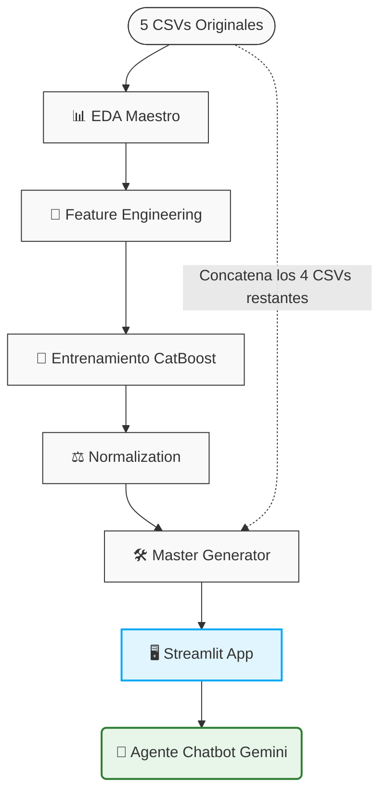

# 📊 Churn Hunters: Salvando el Día (y los Clientes) en Arca Continental

¡Bienvenido a **Churn Hunters**! 🎯 Un proyecto nacido con una misión clara: usar el poder del Machine Learning para predecir qué clientes están en riesgo de abandonar el barco (hacer *churn*) y automatizar estrategias de retención antes de que sea demasiado tarde. 

A través de un análisis profundo del historial de transacciones, infraestructura de frío y datos demográficos, le damos a Arca Continental la ventaja competitiva para mantener felices a sus socios comerciales.

---

## 📊 La Arquitectura de los Datos (Los 5 Mosqueteros)

El proyecto se alimenta de 5 fuentes de datos principales en formato CSV. Durante nuestro pipeline de limpieza, transformamos el historial mensual caótico en un perfil consolidado único por cliente.

| Archivo | Columnas Clave | Descripción |
| :--- | :--- | :--- |
| `clientes.csv` | `customer_id`, `territory_d`, `comercial_subchannel_d`, `rtm_customer_size_d` | **El ADN del cliente:** Región geográfica, tipo de negocio (tiendita, depósito, etc.) y su tamaño. |
| `coolers.csv` | `customer_id`, `calmonth`, `num_coolers`, `num_doors` | **Infraestructura de frío:** Cuántos refrigeradores de AC tiene instalados y cuántas puertas suman. |
| `sales_churn_train.csv` | `customer_id`, `calmonth`, `num_transacciones`, `uni_boxes_sold_m`, `Target` | **Historial de entrenamiento:** Datos mensuales de venta + la etiqueta dorada (1 si se fue, 0 si sigue activo). |
| `sales_churn_test.csv` | `customer_id`, `calmonth`, `num_transacciones`, `uni_boxes_sold_m` | **Historial de prueba:** El comportamiento de los clientes que debemos evaluar y predecir. |
| `preds_submission.csv` | `customer_id`, `prob_churn` | **El entregable final:** La probabilidad (0 a 100) asignada por nuestro modelo. |

> 🛠️ **Nota de Limpieza Extrema:** Nuestro pipeline incluye reglas de negocio estrictas. Si un registro tiene transacciones o cajas negativas con `Target = 0`, ¡se elimina por ruido! Si es `Target = 1`, el dato se corrige a `0` para preservar el historial de fuga sin sesgar las medias aritméticas.

---

## 🧠 El Cerebro Predictivo: CatBoost Classifier 🚀

Para resolver este reto de clasificación, implementamos un modelo basado en **CatBoost**. ¿Por qué? Porque maneja de forma nativa e impecable las variables categóricas (como el subcanal comercial y el tamaño del cliente) sin necesidad de hacer encodings masivos que destruyan la interpretabilidad.

### 📈 Métrica Reina: PR-AUC (Precision-Recall AUC)
Dado que el *churn* suele ser un evento desbalanceado (hay muchos más clientes constantes que clientes que se van), **no nos dejamos engañar por el Accuracy**. 
* Orientamos la optimización hacia el **PR-AUC**.
* Esto nos garantiza que el modelo sea increíblemente preciso al detectar los verdaderos casos de riesgo, maximizando el retorno de inversión de las campañas de retención.

---

## 🖥️ La Joya de la Corona: Streamlit App 💎

No queríamos que este modelo se quedara atrapado en un Jupyter Notebook aburrido. Por eso, montamos una interfaz espectacular en **Streamlit** que se divide en dos grandes superpoderes:

### 1. Dashboard de Métricas y Desgloses Personalizados
* **Visualización Dinámica:** Explora el riesgo de churn segmentando por tamaño de cliente (`Mini`, `Pequeño`, `Mediano`, `Grande`, `Gigante`) o por territorio.
* **Filtros a la Carta:** Analiza la relación entre tener más `coolers` o mayor volumen de cajas (`uni_boxes`) y la lealtad del cliente de forma interactiva.

### 2. 🥤 CHESCO: Tu Asistente de Retención con IA (Gemini Core)
Presentamos a **Chesco**, una implementación personalizada de la tecnología generativa de **Gemini**, totalmente sintonizada con el contexto de Arca Continental y las reglas del reto.

> 💬 *"¿Qué onda? Soy Chesco. Tengo acceso a toda la base de datos para que tú no tengas que hacer más que preguntarme."*

* **Cero Tecnicismos:** Chesco traduce matrices complejas y probabilidades matemáticas a un lenguaje amigable, directo y de negocio.
* **Estrategia a la Medida:** Al consultar un cliente en específico, Chesco evalúa su nivel de riesgo y te arroja una lista de **acciones de retención personalizadas** (ej. *"Noté que este cliente Grande bajó sus transacciones pero tiene 3 coolers libres, te recomiendo ofrecer una promoción de volumen para evitar su posible pérdida"*).

---

## ⚙️ Arquitectura del Pipeline y Flujo de Datos

El proyecto sigue un proceso lineal y modular para transformar los datos crudos en insights accionables dentro de la plataforma interactiva. A continuación se detalla el ciclo de vida de los datos:

### 🕒 Detalle del Flujo Paso a Paso

1. **Ingesta e Inspección (EDA Maestro):** Los 5 archivos CSV crudos entran al módulo de Análisis Exploratorio de Datos (EDA) maestro, donde se generan las analíticas descriptivas y los gráficos de comportamiento base.
2. **Enriquecimiento (Feature Engineering):** Los datos pasan al procesador de ingeniería de variables, donde se calculan métricas de negocio agregadas y evolutivas por cliente.
3. **Entrenamiento:** El modelo predictivo toma las variables resultantes y el set de entrenamiento (`sales_churn_train.csv`) para aprender los patrones de abandono.
4. **Normalización (Normalization):** Los datos resultantes se estandarizan para asegurar estabilidad y homogeneidad en las salidas.
5. **Consolidación (Master Generator):** La pieza clave de integración. Este script toma el archivo de salida de `resultados_normalization` y lo concatena de manera exacta con los 4 CSVs originales que no pasaron por la fase de predicción/normalización directa, construyendo la base de datos maestra unificada.
6. **Despliegue e Interacción (Streamlit & Gemini):** La base unificada alimenta la aplicación de **Streamlit**, la cual renderiza la interfaz gráfica para el usuario y conecta directamente con el **Agente Personalizado de Gemini (CHESCO)** para permitir consultas interactivas con lenguaje natural.

---

## ⚡ El Atajo Rápido: Pipeline de un Solo Clic (`pipeline_churn.py`)

Para hacer el despliegue lo más eficiente posible, consolidamos todos los scripts y pasos intermedios del pipeline en un único archivo maestro: `pipeline_churn.py`. 

Este script actúa como el director de orquesta del proyecto. Al ejecutarlo, realiza de forma secuencial y automatizada todo el ciclo de vida de los datos:

```mermaid
graph LR
    A[Ejecutar pipeline_churn.py] --> B[1. Carga 5 CSVs]
    B --> C[2. Procesa EDA & Features]
    C --> D[3. Entrena e Infiere]
    D --> E[4. Normaliza & Consolida]
    E --> F([💾 Genera: Master Dataset])
    F --> G[🖥️ Carga directa en Streamlit]
    G --> H(🥤 ¡Listo para hablar con Chesco!)

    style F fill:#fff3e0,stroke:#ff9800,stroke-width:2px
    style H fill:#e8f5e9,stroke:#2e7d32,stroke-width:2px
```

---
